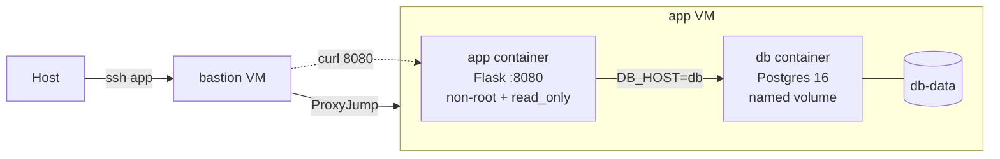

# 期末實作 - 411631269 姚育祺

## 1. 架構總覽



本次期末延續期中的 bastion -> app 底座，在 app VM 上部署 `app + db` 的雙服務 stack。`app` 由自建 Dockerfile 產生，採用 non-root、`read_only`、`cap_drop: [ALL]`、`no-new-privileges:true` 等加固設定；`db` 採用 `postgres:16`，並透過 named volume `db-data` 保留資料。整體服務以 `compose.yaml` 宣告式管理，並使用 healthcheck 控制啟動順序與健康狀態。

## 2. Part A：底座與基準點

### `ssh app` 證據

```bash
ssh app
hostname
```

### Docker / Compose 版本

```bash
docker --version
docker compose version
```

### Snapshot

- VMware snapshot 名稱：`final-baseline`
- 截圖檔名：`screenshots/ssh-and-versions.png`

## 3. Part B：Dockerfile 與快取

### Dockerfile

參考 [app/Dockerfile](/C:/411631269_TKUCVT/final_411631269/app/Dockerfile)。

### 第一次 build

```bash
cd ~/final/app
docker build -t final-app .
```


### 第二次 build

修改 `app.py` 一行後再次 build：

```bash
docker build -t final-app .
```

### 為什麼聽 8080 不聽 80？

這份 app image 以 non-root 身分執行，而且 compose 又進一步設定 `cap_drop: [ALL]`，因此容器內程式不具備綁定 privileged port 的能力。Linux 中 1024 以下的 port 屬於 privileged port，通常需要 root 或 `CAP_NET_BIND_SERVICE` 才能綁定；若改聽 80，Flask 會因權限不足而無法啟動。改成 8080 可以保留 non-root 的安全性，同時讓服務正常運作。

### 快取說明

Dockerfile 先 `COPY requirements.txt` 再 `RUN pip install -r requirements.txt`，最後才 `COPY app.py`。這種排序符合 layer cache 原則：相對少變動的依賴安裝放前面，常變動的應用程式碼放後面。這樣只修改 `app.py` 時，前面的 `pip install` layer cache key 不會失效，因此第二次 build 會顯示 `CACHED`。若在安裝依賴前就先 `COPY . .`，任何 app 程式碼變動都會讓安裝依賴那層重新執行。

## 4. Part C：Compose 與資料持久化

### 啟動與驗證

```bash
cd ~/final
cp .env.example .env
docker compose up -d --build
sleep 15
docker compose ps
curl -s http://localhost:8080/
curl -s -o - http://localhost:8080/healthz -w "\nHTTP %{http_code}\n"
```

```text
NAME         IMAGE         COMMAND                  SERVICE   CREATED         STATUS                    PORTS
final-app-1  final-app     "python app.py"         app       <time>          Up (healthy)              0.0.0.0:8080->8080/tcp
final-db-1   postgres:16   "docker-entrypoint.s…"  db        <time>          Up (healthy)              5432/tcp

411631269 from <container-hostname> | db time(v2) = <timestamp>
ok
HTTP 200
```

### 寫入資料

```bash
docker compose exec db sh -c 'psql -U postgres -d $POSTGRES_DB -c "CREATE TABLE IF NOT EXISTS exam (note text);"'
docker compose exec db sh -c 'psql -U postgres -d $POSTGRES_DB -c "INSERT INTO exam VALUES ('\''411631269'\'');"'
docker compose exec db sh -c 'psql -U postgres -d $POSTGRES_DB -c "SELECT * FROM exam;"'
```

```text
CREATE TABLE
INSERT 0 1
   note
-----------
 411631269
(1 row)
```

### 三段持久化對照

| 階段 | 指令 | `SELECT * FROM exam` 結果 |
| ---- | ---- | ------------------------- |
| 砍容器重建 | `docker compose down && docker compose up -d` | 應該還看得到 `411631269` |
| 連 volume 一起刪 | `docker compose down -v && docker compose up -d --build` | 資料應消失，可能是 `relation "exam" does not exist` 或空表 |
| 重寫資料 | 再執行一次 `INSERT INTO exam VALUES ('411631269');` | 重新出現 `411631269` |

截圖檔名：`screenshots/volume-3-stages.png`


### `down` vs `down -v`

`docker compose down` 只會移除 compose 建立的 service container 與 network，不會刪掉 named volume，因此 `db-data` 仍然存在，Postgres 重新啟動後仍能讀到原本資料。`docker compose down -v` 則會把 compose 相關的 named volume 一併刪除，所以 `db-data` 內的資料也會消失。這表示 named volume 的生命週期與 container 分離，但若明確指定 `-v`，volume 仍會被一併清除。

## 5. Part D：生產化加固

### 權限驗證

```bash
docker compose exec app sh -c "id; cat /proc/self/status | grep -E 'CapEff|NoNewPrivs'"
```

```text
uid=1000 gid=1000 groups=1000
CapEff: 0000000000000000
NoNewPrivs: 1
```

### cgroup 驗證

```bash
PID=$(docker inspect --format='{{.State.Pid}}' $(docker compose ps -q app))
CGPATH=$(cat /proc/$PID/cgroup | head -1 | cut -d: -f3)
cat /sys/fs/cgroup$CGPATH/memory.max
cat /sys/fs/cgroup$CGPATH/cpu.max
cat /sys/fs/cgroup$CGPATH/pids.max
```

```text
268435456
50000 100000
200
```

### yaml 的值怎麼對回 cgroup 檔案？

| compose 設定 | cgroup 讀值 | 對應說明 |
| ---- | ---- | ---- |
| `mem_limit: 256m` | `268435456` | `256 * 1024 * 1024 = 268435456` bytes |
| `cpus: "0.5"` | `50000 100000` | cgroup v2 以 `quota period` 表示 CPU 配額，100000us 內最多使用 50000us，等於 0.5 CPU |
| `pids_limit: 200` | `200` | 容器內最多允許 200 個 process / thread |

### 加固效果說明

- `logging.max-size=10m`、`max-file=3` 用於 log rotation，避免容器日誌吃滿磁碟。
- `mem_limit`、`cpus`、`pids_limit` 限制資源使用上限，避免單一服務失控拖垮整台主機。
- `user: "1000:1000"`、`read_only: true`、`tmpfs: /tmp`、`cap_drop: [ALL]`、`no-new-privileges:true` 降低容器被入侵後的權限與寫入能力。
- `healthcheck` 讓 compose 能辨識服務是否真的健康，而不是只看 process 還活著。

截圖檔名：`screenshots/hardening-verify.png`

## 6. Part E：故障演練

### 故障 1：`docker compose stop db`

- 注入方式：

```bash
docker compose stop db
```

- 故障前：

```bash
docker compose ps
curl -s -o - http://localhost:8080/healthz -w "\nHTTP %{http_code}\n"
```

```text
<app 與 db 都 healthy，HTTP 200>
```

- 故障中：

```bash
docker compose ps
curl -s -o - http://localhost:8080/healthz -w "\nHTTP %{http_code}\n"
docker compose logs --tail=30 app
```

```text
<db 停止後，app 仍 Up，但 /healthz 回 503>
```

- 回復後：

```bash
docker compose start db
sleep 15
docker compose ps
curl -s -o - http://localhost:8080/healthz -w "\nHTTP %{http_code}\n"
```

```text
<db 恢復 healthy，app 也恢復 healthy，HTTP 200>
```

- 診斷推論：

`HTTP 503` 代表 TCP 與 HTTP 都仍可達，表示 app process 仍在 8080 上提供服務；但 app 依賴的資料庫已中斷，所以健康檢查在應用層失敗。這類故障屬於「應用層存活，但依賴服務異常」，與 `connection refused` 不同，因為後者代表連監聽中的 process 都不存在。

### 故障 2：`docker compose stop app`

- 注入方式：

```bash
docker compose stop app
```

- 故障前：

```bash
docker compose ps
curl -v http://localhost:8080/
```

```text
<app healthy，curl 可正常拿到首頁內容>
```

- 故障中：

```bash
docker compose ps
curl -v http://localhost:8080/
ss -tlnp | grep 8080
```

```text
<curl 顯示 connection refused，且 host 上沒有 process 在 listen 8080>
```

- 回復後：

```bash
docker compose start app
sleep 15
docker compose ps
curl -v http://localhost:8080/
```

```text
<app 恢復 healthy，curl 再次成功>
```

- 診斷推論：

`connection refused` 表示封包已到達主機，但 해당 port 沒有任何 process 在監聽，因此問題在服務本身或 container 狀態，而不是外部網路。這與 `HTTP 503` 的差異在於：503 是 app 還活著但依賴掛了；refused 則是 app 本身沒有提供監聽 socket。

### 三症狀分層表

| 症狀 | 最可能的層 | 第一條驗證命令 |
| ---- | ---------- | -------------- |
| timeout | 網路路徑 / 防火牆 / 主機不可達 | `ssh app` 或 `curl -v http://<target>` |
| connection refused | 主機可達，但該 port 沒有 process 在 listen | `ss -tlnp \| grep 8080` |
| HTTP 503 | app process 還活著，但依賴服務失敗或應用內部檢查失敗 | `curl -v http://localhost:8080/healthz` |

## 7. 反思（200 字）

這學期從 VM 做到 production-ready 容器，我對「隔離」這件事有了更具體的理解。VM 透過虛擬化技術提供的是整台系統層級的隔離，讓不同工作負載可以在不同作業系統環境下運行；container 的 namespace 則是在同一個 kernel 上切開 process、network、mount 等執行視角，強調的是執行環境隔離，而不是完整硬體虛擬化。cgroup 再往下處理的是資源控制，它不負責把世界分開，而是限制每個容器最多能用多少 CPU、記憶體與 process 數，避免單一服務失控拖垮整機。最後，non-root、cap_drop、read_only、no-new-privileges 這些權限階梯則是假設攻擊已發生時的損害控制。它們防的對象其實不同，但疊加起來之後，才讓一個從課堂練習長出的服務更接近真正能上線的 production-ready 狀態。

