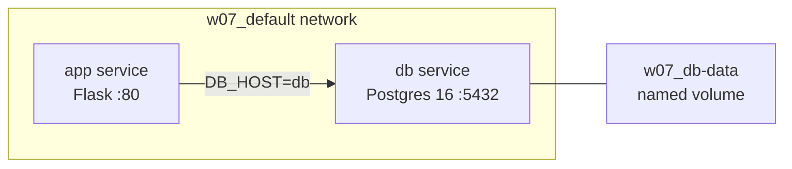

# W07｜Docker Compose 與資料持久化

## 拓樸圖

## 從 docker run 到 compose.yaml
這週我最有感的改善是「重現性變高很多」。如果用 `docker run`，我得自己記住先建 network、再建 volume、再起 db、最後才起 app，還要把密碼和參數分散在好幾條指令裡；只要漏一條，整套服務就起不來。改成 `compose.yaml` 之後，我只要維護一份 YAML 和一份 `.env`，其他人拿到檔案後執行 `docker compose up -d` 就能把 app、db、network、volume 一次建立好，管理和交接都比手動敲指令穩定很多。

## 三種掛載對照
| 掛載類型 | 路徑（host） | 容器砍重起資料還在嗎 | 重啟容器資料狀態 | 適合情境 |
|---|---|---|---|---|
| named volume | Docker 管理的 `/var/lib/docker/volumes/...` | 在，只要沒有 `docker compose down -v` | `down` 後再 `up -d`，資料還在；`down -v` 後資料消失 | 資料庫資料、正式環境持久化 |
| bind mount | `./app:/app` | 在，因為資料直接存在 host 目錄 | host 改檔後容器內立刻看到；重啟容器後檔案仍保留 | 開發時掛 source code、即時同步 |
| tmpfs | 記憶體掛載，不落地到 host | 不在，容器停掉或重啟後會消失 | 重啟後目錄清空，先前寫入的檔案消失 | 暫存快取、敏感暫存資料 |

## healthcheck 前後對照
| 寫法 | curl /healthz t=1s | t=3s | t=5s | t=10s |
|---|---|---|---|---|
| 只 depends_on | 503 | 503 | 200 | 200 |
| service_healthy | 200 | 200 | 200 | 200 |

觀察（自己的話）：  
這次實驗可以清楚看出，單純 `depends_on` 只保證 db 容器先啟動，但不保證 Postgres 已經準備好接受連線，所以前幾秒 `/healthz` 會回 503，等 db 初始化完成後才變 200。加入 `healthcheck` 和 `condition: service_healthy` 後，app 會等 db 真正 healthy 才啟動，因此從外部開始打到 app 的時候就已經能正常連線，整段時間序列都維持 200。也就是說，`depends_on` 解決的是啟動順序，`service_healthy` 解決的是服務是否真的 ready。

## 排錯紀錄
- 症狀：我執行 `docker compose down -v` 之後，重新把服務拉起來，再查 `SELECT * FROM notes;`，Postgres 回 `relation "notes" does not exist`。
- 診斷：檢查 `docker compose down -v` 的輸出後，看到 `w07_db-data` volume 也被一起移除了，所以不是 Postgres 壞掉，而是原本存在 named volume 裡的資料被整個刪掉，db 重新初始化成空狀態。
- 修正：如果只是想重建容器或 network，但要保留資料，就應該使用 `docker compose down`，不要加 `-v`。只有確定要把資料卷一起刪掉時，才使用 `down -v`。
- 驗證：執行 `docker compose down` 後，`docker volume ls` 仍看得到 `w07_db-data`，重新 `docker compose up -d` 後，原本插入的 `notes` 資料仍然存在；改成 `docker compose down -v` 後，volume 被刪除，重新啟動服務後查詢同一張表就報 `relation "notes" does not exist`。

## 設計決策
我讓 db 使用 named volume，而不是 bind mount 或 tmpfs。原因是資料庫資料需要跨容器重建仍然保留，而且不應該依賴 host 上某個手動管理的資料夾；named volume 由 Docker 統一管理，權限、路徑與生命週期都比較適合正式環境。bind mount 雖然方便，但更適合開發中的 source code，因為它是直接把 host 目錄映射進容器，對 portability 和權限管理都比較敏感。tmpfs 更不適合資料庫，因為它只存在記憶體裡，容器一停或一重啟資料就消失，完全不符合資料庫需要持久化的需求。
